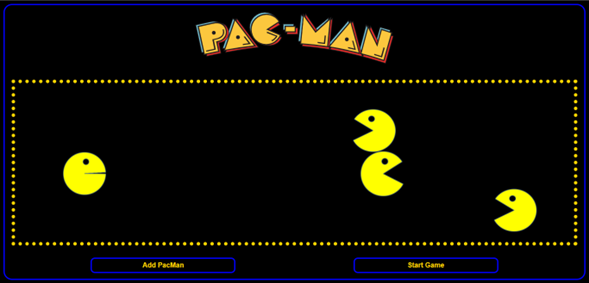

<div align="center" id="top"> 
  
  &#xa0;
</div>

<h1 align="center">PacMen-Factory</h1>

<p align="center">
  

  

  

  
</p>

<p align="center">
  <a href="#dart-description">Description</a> &#xa0; | &#xa0; 
  <a href="#sparkles-roadmap">Roadmap</a> &#xa0; | &#xa0;
  <a href="#white_check_mark-requirements">Requirements</a> &#xa0; | &#xa0;
  <a href="#checkered_flag-starting">Starting</a> &#xa0; | &#xa0;
  <a href="#wrench-support">Support</a> &#xa0; | &#xa0;
  <a href="#memo-license">License</a> &#xa0; | &#xa0;
  <a href="https://github.com/AlexisCastro12" target="_blank">Author</a>
</p>

<br>

## :dart: Description

Do you remember the friendly little yellow ball from the 80's that just eats, eats and eats?? Exactly, we are talking about Pac-Man.

PacMen Factory is a minigame in which it is possible to add as many Pac-Man as you want and then put them in motion within a specific area. This project is an animation work that uses the famous character to show how fun web development can be and how powerful the combination of HTML, CSS and JavaScript can be.

## :sparkles: Roadmap

The characteristics that this project currently has are

:heavy_check_mark: Each pacman that is added performs the opening/closing movement that characterizes this character.

:heavy_check_mark: when a pacman touches some side edge it bounces and changes direction

:heavy_check_mark: An additional pacman can be added each time the corresponding button is pressed.

:heavy_check_mark: The game starts once start game is pressed, it doesn't matter if there is no pacman on the screen.

:heavy_check_mark: The starting position, speed and direction of each pacman is random.

The initial goal of this project is to simulate movement and create animations using front-end web development languages.
However, after fulfilling our purpose, the following changes are proposed for the future:

:pushpin: Add other characters like ghosts.

:pushpin: Add interaction with other objects like another pac man or some ghost

:pushpin: fix the speed increase bug every time the start button is pressed

:pushpin: replicate at least one level from the original game

## :white_check_mark: Requirements

Before starting :checkered_flag:, you need to have [Git](https://git-scm.com) installed.

## :checkered_flag: Starting

```bash
# Clone this project
$ git clone https://github.com/AlexisCastro12/PacMen-Factory

```

Find the folder in the path where the clone was made and open the './index.html' file in any browser (Chrome recommended).

The region where each pacman will move (container delimited with gold dots) is shown in the application's user interface. Just click the add pacman button and then start the game. You will start to see the movement of the character.

You can add as many Pac-Mans as you want before or after starting the game.

## :wrench: Support

If you have problems with the project or need additional information, please contact me at <alexis1204.aacs@gmail.com> :e-mail:.

## :memo: License

This project is under license from MIT. For more details, see the [LICENSE](LICENSE) file.

Made with :heart: by <a href="https://github.com/AlexisCastro12" target="_blank">AlexisCastro12</a>

&#xa0;

<a href="#top">Back to top</a>
